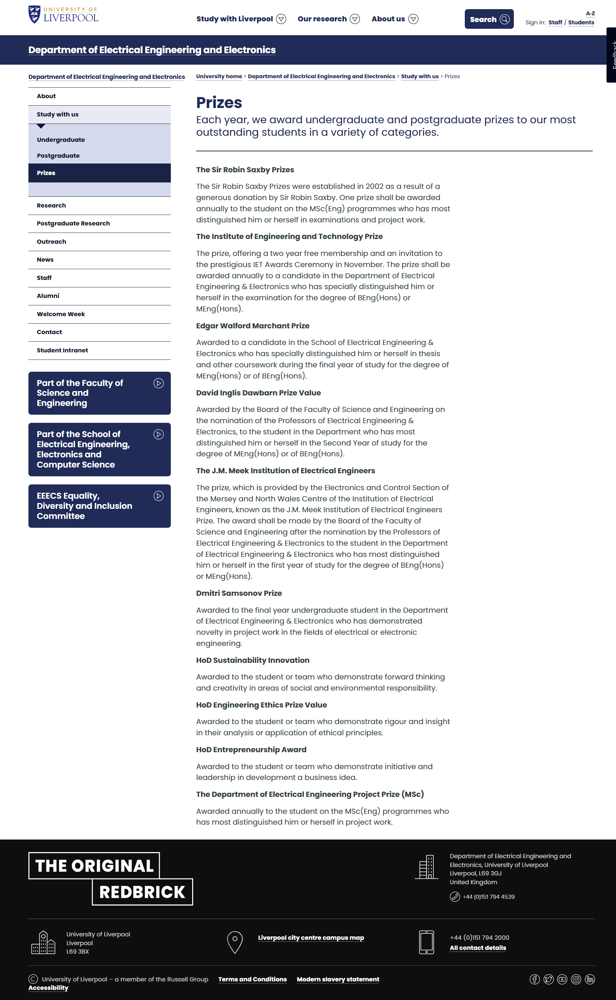

## Certificates

## Assessment and Examination Results

### Component Marks

## Achievements

## Reflection

I consider my undergraduate education to be a failure. I was unable to produce [publishable research](https://ieeexplore.ieee.org/document/9911086), lacked [extensive research experience](https://mp.weixin.qq.com/s/xHTBahrGMRixNa6ur5b52Q), and did not achieve [outstanding academic performance](docs/ruocongwang-academic-transcript.jpg).

I regret choosing an interdisciplinary programme. While I have studied something in each field, I do not have a sufficient understanding of any of them. I am clueless about mechanical engineering, have limited knowledge of electrical engineering and electronics, and did not take any core modules in computer science. What makes me feel most inferior is that I did not receive adequate training in mathematics.
