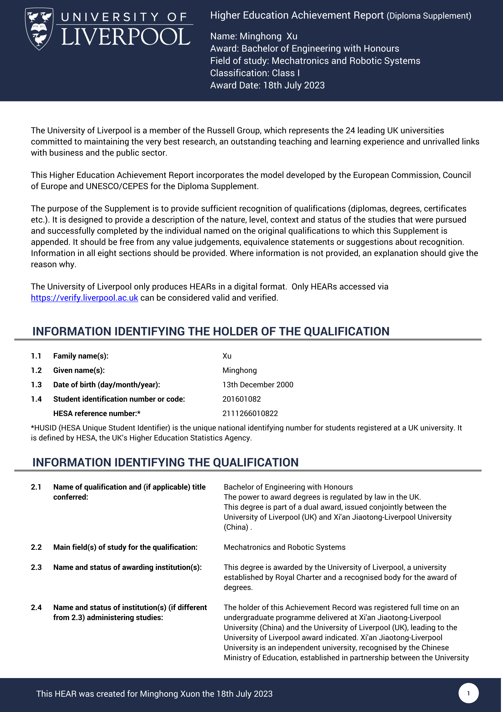

## Reflection

I consider my undergraduate education to be a failure. I was unable to produce [publishable research](https://ieeexplore.ieee.org/document/9911086), lacked [extensive research experience](https://mp.weixin.qq.com/s/xHTBahrGMRixNa6ur5b52Q), and did not achieve [outstanding academic performance](docs/ruocongwang-academic-transcript.jpg).

I regret choosing an interdisciplinary programme. While I have studied something in each field, I do not have a sufficient understanding of any of them. I am clueless about mechanical engineering, have limited knowledge of electrical engineering and electronics, and did not take any core modules in computer science. What makes me feel most inferior is that I did not receive adequate training in mathematics.

> One observation, not obvious for a college student, but obvious for every middle aged human:
>
> When you are in college you can learn the fundamentals or you can practice in pet projects. But it's really much harder to learn the fundamentals after the college, and not so hard to make a project. So if you have livelihood enough and you don't need to work right now, I think it's better to learn theory as much as you can do. And don't worry about lack of practice for now. Your friends will disagree and say that practice is more important than theory, but they will change their mind over the years. Perhaps even your college professors say that practice is more important than theory, but that's because they've been in theory all their lives and have never worked in real economics and feel deprived of practice. You will have dozens of years of further practice, but all the fundamental theory you will know is what you had study in college.

## Certificates

## Assessment and Examination Results

## Achievements

